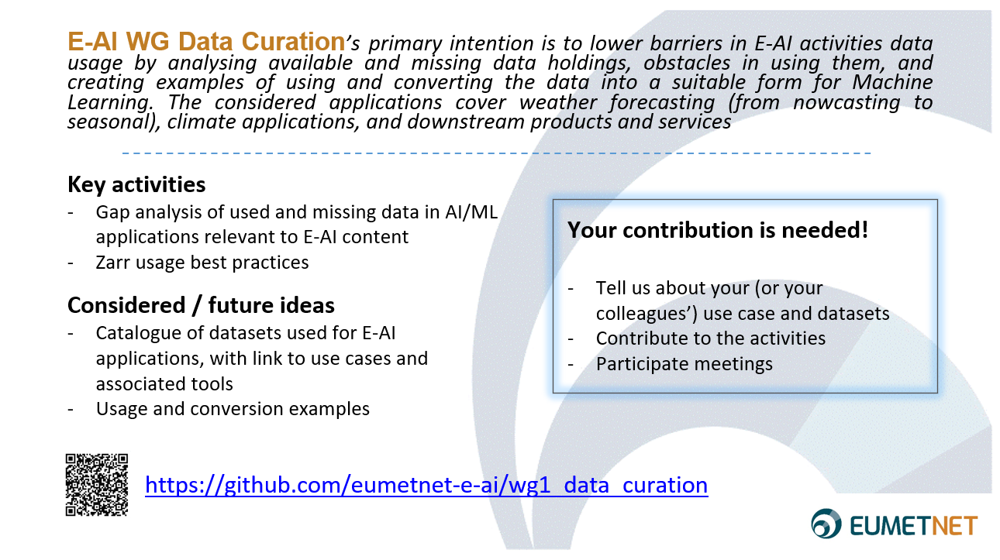

# Minutes of the WG1 Data Curation working meeting 4

## Participants
04 Apr 2025

- Stephan Siemen (ECMWF)
- Roope Tervo (EUMETSAT)
- Arianna Valmassoi (DWD)
- Leif Denby (DMI)
- Sebastien Fortier (ECCC)
- Hugo Vandenbroucke-Menu (ECCC)
- Llorenç Lliso (AEMET/NWCSAF) jllisov@aemet.es
- Yordan Radev (ECCC)
- Marek Jacob (DWD) 
- Sina Montazeri (EUMETSAT)
- Ben Fitzpatrick (UKMO)
- Anna-Lena Erdmann (EUMETSAT)

## Agenda:
- Action review
- Status of the Gap Analysis document, round-table on whether use cases are covered
- Target and schedule for the document
- Group advertisement slide
- July workshop, agenda
- Should we move our meetings to Wednesday / Thursday?
- Update from Zarr sub-group
- Catalogue, should we do it? What should we include?

## Links for convenience
- Our GitHub: [eumetnet-e-ai/wg1_data_curation: Material and Scripts for Data Curation](https://github.com/eumetnet-e-ai/wg1_data_curation)
- Gap analysis document: [https://github.com/eumetnet-e-ai/wg1_data_curation/tree/draft/gap_analysis](https://github.com/eumetnet-e-ai/wg1_data_curation/tree/draft/gap_analysis)
- [Nowcasting MLCast Community](https://docs.google.com/document/d/1iknFj36XdV19udaIsYJhVJLv2Hq-ARjO85jD0jfrYqw/edit?tab=t.0#heading=h.g7k4377ea9do)
- [ML LAM](https://docs.google.com/document/d/1KzMHjl08ESMSpEwJ1eopbWfBp_2MXL-XL63KljWQCZU/edit?tab=t.0#heading=h.66rsmcqr6xup)

## Minutes:
### Intro
- Brief round table of introductions from everyone

### Actions:
- Everyone to add your own use cases and advertise in their organisations
- lcd@dmi.dk to add regional reanalysis datasets list in mllam community document in Gap Analysis document
- Roope Tervo to move regular meeting invitation to Thursday
- Leif and Marek to coordinate on July workshop tutorial content
- Roope Tervo to invite Yordan Radev (ECCC) to Zarr meeting
- Milena Dimitrijevic to add regional reanalysis data to the gap analysis
- Leif and Ben to coordinate on joined use case to the gap analysis 

### Gap Analysis document
- Status of the Gap Analysis document: [https://github.com/eumetnet-e-ai/wg1_data_curation/blob/main/gap_analysis/e_ai_data_gap_analyses.md](https://github.com/eumetnet-e-ai/wg1_data_curation/blob/main/gap_analysis/e_ai_data_gap_analyses.md)

#### How to improve the doc:
- Include diagrams for easier reading?
- Add more/missing regional reanalyses: [https://github.com/eumetnet-e-ai/wg1_data_curation/blob/main/gap_analysis/e_ai_data_gap_analyses.md#european-regional-reanalyses](https://github.com/eumetnet-e-ai/wg1_data_curation/blob/main/gap_analysis/e_ai_data_gap_analyses.md#european-regional-reanalyses) We can have a section for each continent/region, or we can make it general as “regional reanalyses”, depending how many other products we get

#### Aim:
- Listing Datasets isn’t reasonable in the document. We have other mechanisms such as WIS2 and numerous other catalogues for that. We might instead need a procedure to advertise datasets and living catalogues beside. 

#### Discussion input for catalog options:
- Consider WMO's Wis2.
- Tobi Kollings thoughts on stac vs intake: [https://orcestra-campaign.org/data_concept.html#catalog](https://orcestra-campaign.org/data_concept.html#catalog) (maybe others have thoughts on this too?)
- eurec4a intake catalog: [https://github.com/eurec4a/eurec4a-intake](https://github.com/eurec4a/eurec4a-intake) (this is what we’re aiming for within the mlcast community)

- We should identify and justify needed actions / improvements

#### Tools:
- regridding not only in the horizontal, but including the vertical. Having it is fast and compatible with ML. ECCC has a working library called georef but is currently written in C and Fortran but Python bindings are coming soon and it will be open source. 
- [Geospatial reprojection in Python 2024](https://www.youtube.com/watch?v=p9V_4iHleJg) - what’s available and what’s next pangeo talk on reprojection in Python

### Target and schedule for the document:
- Target to get to the level of a journal article. This might motivate people to contribute to analysis and catalogue. 
- We should focus on gaps, not only data content but also tooling and other aspects, such as: 
  - tools
  - georeference
  - formats & vocabularies

- Idea: write/create diagram on workflow(s), general (ref. Pangeo diagram)
- Focus on numerical datasets instead of text data? Contact LLM group to check how to interact.

#### Timeline: 
- end of the year: draft ready for submission
- september: main writing done

### Group advertisement slide
- We still need more use-cases, so everyone should advertise internally and this ad-slide can be easily used for this purpose.

#### Link to GitHub:

WG Data Curation slide: 
- PDF: [presentations/WG_data_curation.pdf](../presentations/WG_data_curation.pdf)
- Power point: [presentations/WG_data_curation.pptx](../presentations/WG_data_curation.pptx)

### July workshop
- E-AI Products and Services Workshop: 2025-07-07 – 2025-07-10 a in-person workshop in Offenbach (Germany)
- Our slot on Wed 9 July 09:00 - 10:30 CEST + 11:00-12:30 CEST

#### Proposed agenda: 
- 9 - 10:00 data curation + discussion on missing datasets
- 10 - 10:30 Zarr best practices
- 11 - 11:15 OPERA - SEVIRI
- 11:15 - 11:45 CDR (climate data records) vs NRT (near real time)
- 11:45 - 12:15 Anemoi datasets
- 12:15-12:30 Discussion (e.g. discussion where are you stuck? What did you try?)

- Other topics? Anyone want to present?

#### Tutorials on Monday (target=beginners, and then go into more details): can we contribute to something/specific topic, i.e. 
- best practice/how to view/work with zarr?
- Explain how to use catalogues?
- how to convert grib2-to-zarr? 
- technical aspect of zarr (e.g. thread-safe, dask): easy example vs real-world/production aspects, e.g. big-data and how to use them. Limitations of zarr with very big datasets (>100TB), due to the index.

### Data Tooling tips
- gribscan (used to convert DANRA GRIB files to zarr): [https://github.com/gribscan/gribscan](https://github.com/gribscan/gribscan), and here's a recent demo Leif gave: [https://github.com/leifdenby/gribscan-demo](https://github.com/leifdenby/gribscan-demo)
- Iris ([https://scitools-iris.readthedocs.io/en/latest/further_topics/ugrid/data_model.html](https://scitools-iris.readthedocs.io/en/latest/further_topics/ugrid/data_model.html)) can do various operations on unstructured grids, but no differential calculus - will save link to pyshtools

### Regular meeting time
- Should we move our meetings to Wednesday / Thursday --> Thursday 2pm CEST

### Short update from Zarr sub-group
- Meetings on second Friday each month, so far we have managed to build agenda for future meetings

All minutes at: [https://docs.google.com/document/d/1FSv0AbEUlv-o1-d3aucnpB3ZCFtQwItvWK_DUTHUIY4/edit?usp=sharing](https://docs.google.com/document/d/1FSv0AbEUlv-o1-d3aucnpB3ZCFtQwItvWK_DUTHUIY4/edit?usp=sharing)

### Presentation schedule

| Organisation | Presenter | Title | Preferred duration | Preferred month |
|--------------|-----------|-------|--------------------|-----------------|
| EODC         | Christoph Remer | Zarr experiences at ESA | 20 min | 11 Apr |
| EUMETSAT     | Anna-Lena Erdman, Armagan Karatosun | Zarr experiments at EUMETSAT | | 11 Apr |
| UKMO         | Mark Burgoyne | Experiments in storing NWP data as Zarr/Kerchunk/VirtualiZarr | | May |
| GeoSphere    | Irene Schicker | Reanalyses in Zarr | | May |
| ECMWF        | TBC | Experiences of using zarr within Anemoi framework | 15-20 min | June? |
| AEMET / NWC SAF | Llorenç Lliso | virtualizarr/icechunk experiments | | June 13 |

### Catalogue
- Catalogue, should we do it? What should we include?
- Minimal subset of (actual variables) variables to share (e.g. for benchmarking)?
  - mllam target to create km-scale benchmarking (very resource-intensive though)
  - different benchmarks are very application-specific

- We need EWC version of AWS Public dataset programme